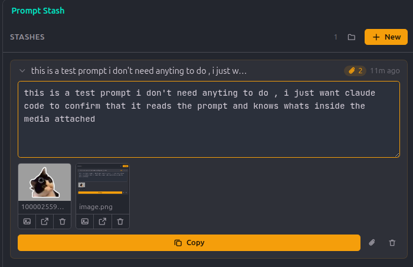

<div align="center">

# 📌 Prompt Stash

### Park an unfinished AI prompt — screenshots and all — and pick it up again later


<br>



</div>

---

## 😩 The problem

You're halfway through a long prompt. Two screenshots pasted in, three paragraphs of context written.

Then the agent errors out. Or you realise you need to go check something first.

Now what? Cut it into a scratch file and you keep the words — and **lose every screenshot**. Leave it in the chat box and it's gone the moment you type something else.

## ✨ The fix

```
✍️  write  →  📌 stash  →  🔧 go fix the thing  →  📋 copy  →  ✅ paste it back
```

Prompt Stash keeps the whole draft together — text *and* images *and* files — in a sidebar panel, ready to copy back out whenever you are.

---

## 🎁 What you get

### 🗂️ As many drafts as you want

Every stash is a card, newest first, titled by its own first line. Text **saves itself as you type** — there's no save button to forget.

### 🖼️ Screenshots that stay put

Paste an image straight into a draft, **drag any file onto the card** — a screenshot, a JSON dump, a log — or pick them with 📎. The whole card is a drop target, so you don't have to aim. They live with the draft instead of evaporating when you clear the chat box.

### 🔍 A real look at what you attached

Hover a thumbnail, click it, and it opens full-panel — zoom with the wheel, the buttons or <kbd>+</kbd>/<kbd>−</kbd>, drag to pan, <kbd>Esc</kbd> to close. Zoom follows your pointer, so you can actually **read the stack trace** in that screenshot.

### 📋 One paste puts it back

**Copy** puts the prompt and every attachment path on your clipboard. One paste, and the assistant has the text and can read the images from disk.

> Nothing gets focused, opened or clicked on your behalf. It copies. That's it.

### 🔄 The same stashes in VS Code *and* Cursor

Stashes live in your home folder, not inside either editor's private storage — so both see the same list. Park a draft in one, pick it up in the other.

---

## 🚀 Getting started

Click the 🔖 in the activity bar, or hit <kbd>Ctrl</kbd>+<kbd>Shift</kbd>+<kbd>Alt</kbd>+<kbd>P</kbd>.

| I want to… | Do this |
|:---|:---|
| 🆕 Start a draft | **New**, top right of the panel |
| 🆘 Rescue a prompt I already typed | Select it, <kbd>Ctrl</kbd>+<kbd>C</kbd>, then <kbd>Ctrl</kbd>+<kbd>Alt</kbd>+<kbd>S</kbd> — stashed without opening a thing |
| 🖼️ Attach a screenshot | Paste it straight into the draft |
| 📥 Attach any file | Drag it onto the open card from your file manager or the editor's explorer |
| 🔍 Inspect an attachment | Hover its thumbnail and click |
| 📋 Use the draft | **Copy**, then paste into any chat box |
| 📂 Find the files on disk | The 📁 icon in the header |

### ⌨️ Commands

| Command | Keybinding |
|:---|:---|
| `Prompt Stash: Open Prompt Stash` | <kbd>Ctrl</kbd>+<kbd>Shift</kbd>+<kbd>Alt</kbd>+<kbd>P</kbd> |
| `Prompt Stash: Stash Clipboard Text` | <kbd>Ctrl</kbd>+<kbd>Alt</kbd>+<kbd>S</kbd> |
| `Prompt Stash: Copy Latest Stash` | — |

---

## 📎 How attachments reach the assistant

**Copy** gives you the prompt followed by the path of each attachment:

```
Fix this layout bug — the sidebar overlaps the content below 900px.

Attached files:
- /home/you/.prompt-stash/media/stash-1738.../att-1-shot.png
```

Paths rather than the pictures themselves, because the clipboard physically cannot carry both at once — and because paths work with assistants that refuse pasted images.

<details>
<summary><b>🤔 The longer version</b></summary>

<br>

A clipboard entry holds **one item in alternative formats**, not a list of things. Paste handlers pick a single format, and image data always beats text — so a prompt *and* three screenshots can never arrive in one paste.

Paths sidestep it: one paste, and any assistant that can read a file picks the images up from there. It's also the only approach that works with assistants that refuse pasted images outright, Claude Code included.

</details>

Pick the shape with `promptStash.attachmentFormat`:

| Value | Output | Best for |
|:---|:---|:---|
| 🥇 `paths` *(default)* | `- /abs/shot.png` under `Attached files:` | Claude Code, terminal agents |
| 📝 `markdown` | A Markdown image link | Anything that renders Markdown |
| 💬 `at-mentions` | `@/abs/shot.png` | Cursor |

### 🎨 Want a true inline image paste?

Image thumbnails also offer **Copy as image**, which puts real picture data on the clipboard — one image per click, for the reason above.

| Editor | Works? |
|:---|:---|
| Cursor | ✅ |
| Copilot Chat | ✅ |
| Claude Code extension | ❌ discards pasted images — use **Copy** |

Non-PNG images convert automatically, and if the system refuses the write, the file path is copied instead and the panel tells you so.

---

## ⚙️ Settings

| Setting | Default | What it does |
|:---|:---|:---|
| `promptStash.storePath` | `~/.prompt-stash` | Where stashes and their files are kept |
| `promptStash.attachmentFormat` | `paths` | How attachment paths are written into the copied text |
| `promptStash.maxAttachmentMb` | `20` | Largest single attachment accepted |

## 💡 Good to know

- 🗑️ **Deleting a stash deletes its attachments**, so the folder never fills with files nothing points at.
- 🔁 **Changing `storePath` needs a window reload** before attachments display again.
- 📐 **Text and images can't share one paste** — a clipboard limitation, explained above.

## 🔒 Privacy

Everything stays on your machine. Stashes and attachments are plain files in your home folder, and the extension **makes no network requests whatsoever**. No accounts, no telemetry, no phoning home.

---

<div align="center">

**Built by Abdelrahman Seada**

[](https://x.com/abdoseadaa)
[](https://www.linkedin.com/in/abdoseadaa/)

</div>
